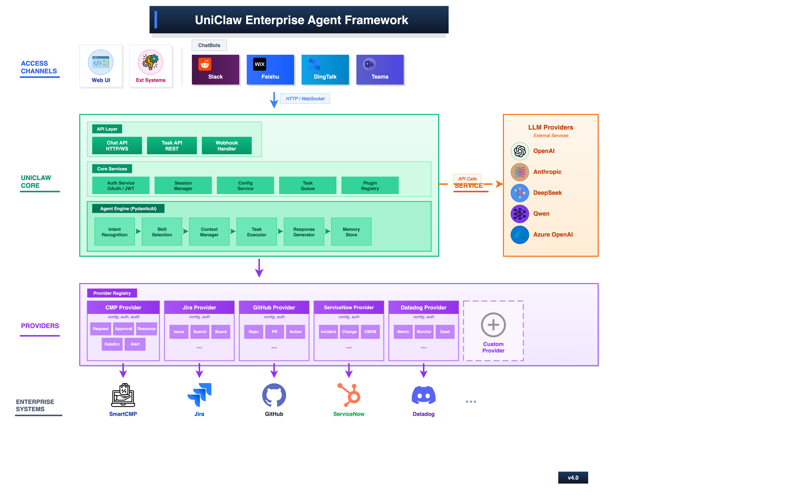
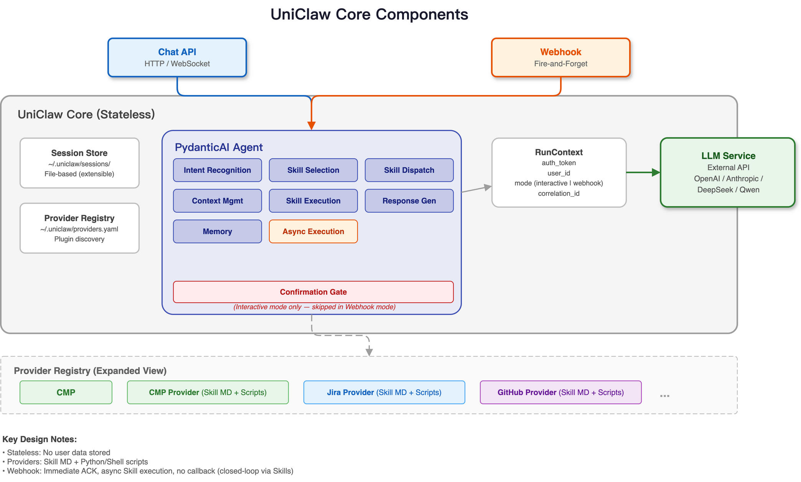

# AtlasClaw 中文说明文档

> 本文档是 [README.md](README.md) 的中文版本，用于中文开发者快速了解与接入 AtlasClaw。
> 权威的架构、模块与开发规范以 `docs/` 目录下的英文文档为准：
> [架构设计](docs/ARCHITECTURE.MD)、[模块详解](docs/MODULE-DETAILS.MD)、[开发规范](docs/DEVELOPMENT-SPEC.MD)。
>
> **重要**：本仓库只包含 AtlasClaw **核心实现**（Agent 运行时、API 层、渠道适配器、Provider 注册、技能、工具、会话与记忆管理）。具体的企业系统 Provider **不在本仓库**，AtlasClaw 通过 `providers_root` 从外部 Provider 包加载，常见布局为同级的 `../atlasclaw-providers/providers`。

---

## 目录

1. [项目简介](#1-项目简介)
2. [核心能力](#2-核心能力)
3. [部署模式](#3-部署模式)
4. [架构概览](#4-架构概览)
5. [仓库结构](#5-仓库结构)
6. [快速开始](#6-快速开始)
7. [配置说明](#7-配置说明)
8. [扩展点](#8-扩展点)
9. [数据与安全](#9-数据与安全)
10. [开发与测试](#10-开发与测试)
11. [部署与运维](#11-部署与运维)
12. [文档索引](#12-文档索引)
13. [许可证](#13-许可证)

---

## 1. 项目简介

AtlasClaw 是一个**企业级 AI Agent 框架**，让员工通过一个统一的对话式 AI 入口，跨 CRM、ITSM、监控、HR、财务、OA 等企业内部系统完成查询、分析与流程操作，而不必在多个控制台、看板与审批门户之间来回切换。

企业软件团队面对的核心难题不只是"系统割裂"，还有各系统之间**数据模型、流程边界、授权模型和用户体验**的不一致。AtlasClaw 围绕开发者的两个实际问题设计：

- 如何在企业现有系统之上，提供统一的 AI Agent 体验？
- 如何让企业软件开发者快速为自己的系统增加 Agent 能力，而不必从零搭建 Agent 基础设施？

为此，AtlasClaw 提供：跨系统工作流的统一对话层、可插拔的 Provider 模型、贯穿始终的权限继承，以及 Web UI、内嵌面板、IM 平台与 Webhook 的多通道接入。框架**不绕过 RBAC、不提升权限**，平台自身的授权与审计仍留在原系统中。

## 2. 核心能力

- **LLM 驱动的 Skills 模型**：用技能定义业务场景、决策边界与系统交互方式，替代传统硬编码工作流。
- **跨系统 Agent 大脑**：面向企业软件的跨系统分析、判断、协调与执行。
- **Provider 集成模型**：开发者可快速为 Agent 增加新系统能力。
- **薄核心（Thin Core）**：平台相关逻辑在 Provider，可复用的 Agent 逻辑在核心。
- **可嵌入的 Agent 基础**：面向企业应用开发者的内嵌能力。
- **上下文感知浮窗助手**：跟随企业系统页面导航，把当前页面对象绑定到匹配的 Provider Skill。
- **API 优先**：交互式 REST API、WebSocket 流式、Webhook 入口。
- **灵活的 LLM 后端**：通过配置对接外部模型 Provider（OpenAI / Anthropic 兼容等）。

## 3. 部署模式

### 3.1 内嵌 Agent 模式（Embedded）

把 AtlasClaw 作为既有企业系统内部的一个 AI 模块，服务该系统自身的用户、数据与业务场景：

- 提供两个可独立部署的入口：完整菜单 UI 与紧凑浮窗 UI；
- 两个入口复用企业系统 Cookie 认证上下文，共享当前登录用户的既有权限；
- 菜单集成只需嵌入 `embedded=1&surface=menu`，浮窗模式由企业系统管理 iframe 启动器并上报归一化页面路径（含 nonce 与递增 generation）；
- Core 确定性匹配 Provider 声明的路由清单，Provider resolver 解析可见业务对象与状态相关动作；
- 支持用户交互与自动化两种使用方式，适合快速为已有产品增加 AI 能力。

集成组件是 AtlasClaw 中配置的 **HostApp Provider**。参见 [内嵌集成说明](docs/EMBED-INTEGRATION.md)。

### 3.2 独立 Agent 模式（Standalone）

作为独立的企业 AI Agent 平台运行，通过 Provider 连接并协调多个系统，构建跨系统的统一入口，适合希望在企业范围内提供单一 AI 入口的团队。

## 4. 架构概览

AtlasClaw 围绕**薄核心 + 丰富 Provider** 组织。

### 4.1 总体架构



请求从任一受支持通道进入，经 AtlasClaw Core，最终通过 Provider 作用到企业系统。内嵌模式在企业系统内部暴露两个入口（菜单 UI 与浮窗 UI），二者共享同一 Cookie 认证上下文；Core 将归一化路径与 Provider 的 Context 路由做确定性匹配，Provider 解析可见业务对象及其当前动作，产生的 Context 在进入正常 Chat 与工具执行链路前，会与匹配的 Skill 及当前用户权限完成绑定。

### 4.2 核心组件



| 组件 | 职责 |
|---|---|
| **API Layer** | 交互式 API、SSE 流式、WebSocket 与 Webhook 入口 |
| **Agent Engine** | 路由、Prompt 构建、能力选择、工具编排、上下文压缩 |
| **Session & Memory** | 会话上下文、持久化与检索 |
| **Tools & Skills** | 暴露给 Agent 的可复用执行单元 |
| **Provider Registry** | 企业集成的注册与发现 |
| **Execution Context** | 认证、租户与运行时数据的依赖注入 |

### 4.3 请求处理流程（简要）

1. `AuthMiddleware` 提取凭证（Authorization 头 / 配置 Cookie），交由 `AuthStrategy` 与具体 Auth Provider 认证，并解析为数据库用户，注入 `UserInfo`；
2. 路由处理器解析会话键，构造请求级 `SkillDeps`；
3. `AgentRunner.run()` 进入单入口三阶段状态机：准备（构建能力面与工具门控）→ 模型循环（流式输出与工具执行）→ 收尾（持久化与生命周期事件）；
4. 结果以 SSE 事件流返回，支持 `Last-Event-ID` 断点续传。

## 5. 仓库结构

```text
atlasclaw/
├── app/
│   ├── atlasclaw/
│   │   ├── main.py            # FastAPI 应用工厂与 lifespan 启动装配
│   │   ├── agent/             # Agent 运行时：执行、路由、Prompt、压缩、工具门控
│   │   ├── api/               # REST / SSE / WebSocket / Gateway / Webhook
│   │   ├── auth/              # 认证管线、Auth Provider、RBAC 守卫
│   │   ├── bootstrap/         # 路由挂载、base_path、启动助手
│   │   ├── channels/          # 渠道适配器与处理器（飞书/钉钉/企微等）
│   │   ├── core/              # 配置、依赖注入、Provider 注册、Token 池、加密、Embed
│   │   ├── db/                # SQLAlchemy ORM、Service、Schema
│   │   ├── heartbeat/         # 统一周期任务运行时
│   │   ├── hooks/             # 生命周期钩子与 Hook Runtime
│   │   ├── media/             # 链接抽取、文档/图片/音频理解、TTS
│   │   ├── memory/            # 长期记忆与混合检索
│   │   ├── messages/          # 入站/出站消息归一化与斜杠命令
│   │   ├── models/            # LLM Provider 配置、预置、failover、重试
│   │   ├── session/           # 会话键、JSONL 持久化、队列
│   │   ├── skills/            # 技能注册、加载与权限
│   │   ├── tools/             # 内建工具、目录、策略与审批
│   │   └── workflow/          # DAG 工作流引擎
│   └── frontend/              # Web UI（零框架 ES Module + Deep Chat）
├── build/                     # 镜像构建、Compose、安装/升级、systemd
├── docs/                      # 架构、模块、开发规范、Provider/Skill/Channel 指南
├── migrations/                # Alembic 数据库迁移
├── tests/                     # Pytest 后端测试 + Jest 前端测试
├── atlasclaw.json             # 核心配置
└── requirements.txt           # 运行依赖
```

## 6. 快速开始

### 6.1 环境要求

- Python 3.11+（建议）
- 建议使用虚拟环境
- 需要可访问的 LLM Provider；端到端集成还需目标企业系统

### 6.2 安装依赖

```bash
python3 -m venv .venv
source .venv/bin/activate        # Linux/macOS
.venv\Scripts\activate       # Windows

# 运行时依赖
pip install -r requirements.txt

# 开发与测试（包含 pytest）
pip install -r requirements-dev.txt
```

### 6.3 配置

复制示例配置并按需修改：

```bash
cp atlasclaw.json.example atlasclaw.json
cp .env.example .env
```

```json
{
  "providers_root": "../atlasclaw-providers/providers",
  "model": {
    "primary": "deepseek/deepseek-chat",
    "fallbacks": ["doubao/doubao-seed-1-6-lite-251015"],
    "temperature": 0.7,
    "providers": {
      "deepseek": {
        "base_url": "https://api.deepseek.com",
        "api_key": "${DEEPSEEK_API_KEY}",
        "api_type": "openai"
      }
    }
  }
}
```

配置文件中所有 `${VAR_NAME}` 占位符会在加载时从环境变量展开；敏感值建议放入 `.env`。

### 6.4 启动服务

```bash
uvicorn app.atlasclaw.main:app --reload --host 0.0.0.0 --port 8000
```

服务地址：http://127.0.0.1:8000 ，交互式 API 文档：/docs 与 /redoc。

启动成功时可看到类似日志：

```text
[AtlasClaw] Registered N built-in tools
[AtlasClaw] Agent created with model: deepseek/deepseek-chat
[AtlasClaw] Application started successfully
[AtlasClaw] Skills loaded: X executable, Y markdown
```

### 6.5 访问 Web UI

浏览器打开 `http://127.0.0.1:8000/`，即可使用聊天界面、实时流式响应、中英文多语言与会话历史。

### 6.6 前端开发

```bash
cd app/frontend
npm install
npm test          # Jest + jsdom
npm run build     # 生产打包（企业模式）
npm run build:dev # 开发打包（含 sourcemap）
```

开源模式默认**直接托管源码、无需构建**；企业模式用 esbuild 打包出 `dist/app.min.js`。修改 `app/frontend/scripts/` 后刷新浏览器即可。

## 7. 配置说明

### 7.1 配置优先级（高 → 低）

1. 运行时覆盖：`config_manager.set("agent_defaults.timeout_seconds", 600)`
2. 环境变量：`ATLASCLAW_<SECTION>__<KEY>`（双下划线表示嵌套）
3. 用户配置：`~/.atlasclaw/config.json`
4. 工作区配置：`.atlasclaw/atlasclaw.json`
5. 项目配置文件：`atlasclaw.json` / `atlasclaw.yaml`
6. Schema 默认值：`core/config_schema.py`

### 7.2 模型与 Token 池

`model.primary` 指定主模型（格式 `provider/model-name`），`model.fallbacks` 指定降级模型。多 Token 场景可配置 `model.tokens[]`（含 `id/provider/model/base_url/api_key/api_type/priority/weight`），并通过 `model.selection_strategy` 选择策略：`health`（默认）、`priority`、`random`、`round_robin`。`api_type` 支持 `openai` 与 `anthropic`。

### 7.3 服务 Provider 实例

```json
{
  "service_providers": {
    "ticketing": {
      "prod": {
        "base_url": "https://ticketing.corp.com",
        "username": "${TICKETING_USERNAME}",
        "password": "${TICKETING_PROD_TOKEN}",
        "api_version": "2"
      }
    }
  }
}
```

格式为 `{ provider_type: { instance_name: { 连接参数 } } }`，同一 Provider 支持多实例。数据库中的配置会与 JSON 配置合并，**同键以数据库为准**。

### 7.4 数据库

- **SQLite（默认）**：零配置，启动时按 ORM 自动建表，适合开发与单节点部署；
- **MySQL（企业）**：需通过 Alembic 迁移管理 DDL，适合多节点生产部署。

```json
{
  "database": {
    "type": "sqlite",
    "sqlite": { "path": "./data/atlasclaw.db" },
    "mysql": {
      "host": "${MYSQL_HOST}",
      "port": 3306,
      "database": "${MYSQL_DATABASE}",
      "user": "${MYSQL_USER}",
      "password": "${MYSQL_PASSWORD}",
      "charset": "utf8mb4"
    }
  }
}
```

### 7.5 认证

`auth.provider` 可选 `none` / `local` / `host_cookie` / `oidc_jwt` / `oidc_login`。其中 `oidc_jwt` 用于 API Bearer Token 校验，`oidc_login` 提供浏览器 OAuth2 + PKCE 单点登录；`host_cookie` 用于内嵌场景，可与本地管理员登录共存。

### 7.6 Webhook

```json
{
  "webhook": {
    "enabled": true,
    "header_name": "X-AtlasClaw-SK",
    "systems": [
      {
        "system_id": "external-review",
        "enabled": true,
        "sk_env": "${ATLASCLAW_WEBHOOK_SK_EXTERNAL_REVIEW}",
        "default_agent_id": "main",
        "allowed_skills": ["external-review:review"]
      }
    ]
  }
}
```

Webhook 调用方通过配置的密钥头认证，随后只能派发该系统中 `allowed_skills` 列出的技能。详见 [Webhook 自动化](docs/automation/webhook.md)。

### 7.7 常用环境变量

| 变量 | 说明 | 默认 |
|---|---|---|
| `ATLASCLAW_CONFIG` | 配置文件路径 | `atlasclaw.json` |
| `ATLASCLAW_ENCRYPTION_KEY` | 敏感数据加密主密钥（生产必设） | 内置开发密钥 |
| `ATLASCLAW_JWT_SECRET` | JWT 签名密钥 | 弱默认值 |
| `ATLASCLAW_<SECTION>__<KEY>` | 任意配置项覆盖 | — |
| `CORS_ORIGINS` | 允许的跨域来源 | 本地来源 |
| `LOG_LEVEL` | 日志级别 | `INFO` |
| `NO_PROXY` | 绕过代理的地址 | — |

## 8. 扩展点

### 8.1 Provider（企业系统集成）

```text
<providers_root>/<provider_name>/
├── PROVIDER.md          # 必需：文档 + LLM 路由上下文（frontmatter）
├── provider.schema.json # 固定文件名：配置清单（缺失则不进配置 UI）
├── README.md            # 可选：人类可读文档
└── skills/
    └── <skill_name>/
        ├── SKILL.md
        └── scripts/
```

`PROVIDER.md` 的 frontmatter 必需 `provider_type` / `display_name` / `version`，推荐 `keywords` / `capabilities` / `use_when` / `avoid_when`。技能会以 `provider:skill` 命名空间注册，避免重名冲突。参见 [Provider 指南](docs/PROVIDER-GUIDE.MD)。

### 8.2 Skill（技能）

支持三种形态：

| 类型 | 说明 | 文件 |
|---|---|---|
| **可执行（Executable）** | 带 `SkillDeps` 的 Python 函数 | `SKILL.md` + `handler.py` |
| **Markdown** | 纯提示/指令型技能 | `SKILL.md` |
| **混合（Hybrid）** | 可执行 + Markdown 文档 | 二者 |

技能返回值约定为 `{success, message, data, error}`。参见 [技能指南](docs/SKILL-GUIDE.MD)。

### 8.3 Channel（渠道）

实现 `ChannelHandler` 抽象类并注册，即可接入新的通信平台；内建支持 WebSocket、REST、SSE 以及飞书、钉钉、企业微信。参见 [渠道指南](docs/CHANNEL-GUIDE.MD)。

### 8.4 Auth Provider（认证扩展）

继承 `AuthProvider` 并实现 `authenticate(credential) -> AuthResult`，然后注册到 `AuthRegistry`。契约要求真正校验凭证。

### 8.5 Tool（工具）

在 `tools/catalog.py` 中定义并归组（`group:*` 与 `capability_class`），实现后于 `tools/registration.py` 注册；内建/Provider/Skill 工具统一为一类运行时工具对象，在同一模型循环内决策。

### 8.6 Hook 与 Hook Runtime

- **HookSystem**：17+ 生命周期阶段的拦截（Gateway / Session / Agent / Prompt / LLM / Tool / Message / Compaction），支持顺序（可改上下文）与并行（只观察）。
- **HookRuntime**：通用运行时事件分发、按用户/模块的状态存储、待确认项、Memory/Context Sink，以及配置驱动的本地脚本处理器。参见 [Hook Runtime 指南](docs/HOOK_RUNTIME_GUIDE.md)。

### 8.7 Embed 集成

通过 `embed_integration` 配置 HostApp Provider，并使用 `atlasclaw-embed/v1` 协议做页面上下文解析。核心要求：严格校验来源/origin/nonce/generation，**失败封闭**，凭据绝不进入消息、浏览器存储或快照。参见 [内嵌集成说明](docs/EMBED-INTEGRATION.md)。

## 9. 数据与安全

- **权限继承**：运行期动作始终使用认证用户的上游身份与 Token（`SkillDeps.user_info.raw_token`），不绕过、不提升权限；管理面另有一套工作区 RBAC。
- **加密**：LLM API Key、Service Provider 配置、渠道凭据均以 **AES-256-GCM** 加密存储（格式 `v1:<key_id>:base64(...)`），配置文件也支持 `enc:` 前缀自动解密。
- **存储布局**：

```text
<workspace>/
├── agents/main/{SOUL,IDENTITY,USER,MEMORY}.md   # Agent 定义
└── users/<user_id>/
    ├── user_setting.json                        # 用户配置
    ├── sessions/                                # JSONL 会话转录
    ├── memory/MEMORY.md                         # 长期记忆
    ├── hooks/<module>/                          # Hook 运行时状态
    └── heartbeat/                               # 心跳任务状态
```

- **会话键**：`agent:<agentId>:user:<userId>:<channel>:<accountId>:<chatType>:<peerId>[:<threadId>]`，用户之间按目录隔离。
- **多租户**：通过路径前缀隔离会话与记忆，并支持配额校验。

## 10. 开发与测试

### 10.1 后端测试

```bash
pytest tests/atlasclaw -q

# 单文件 / 单类 / 单方法
pytest tests/atlasclaw/test_agent.py -v
pytest tests/atlasclaw/test_agent.py::TestStreamEvent -v
pytest tests/atlasclaw/test_agent.py::TestStreamEvent::test_create_lifecycle_start -v

# 按标记筛选
pytest -m "not slow"     # 跳过慢测试
pytest -m llm            # 需要 LLM API Key
pytest -m e2e            # 端到端测试

# 覆盖率
pytest --cov=app.atlasclaw --cov-report=term-missing
```

测试标记：`slow` / `integration` / `e2e` / `llm`。默认使用 `tests/atlasclaw.test.json`，其中 Provider 指向外部 Provider 仓库。

### 10.2 前端测试

```bash
cd app/frontend && npm test
```

### 10.3 开发规范

提交信息遵循 Conventional Commits（`feat` / `fix` / `docs` / `refactor` / `test` / `chore`），格式 `<type>(<scope>): <summary>`。改动前请先阅读 [开发规范](docs/DEVELOPMENT-SPEC.MD) 与 [架构设计](docs/ARCHITECTURE.MD)。

关键运行时约定：

- 单一能力面、无独立 planner 调用；每次模型再入都要带 `loop_index` / `loop_reason` / `selected_capability_ids`；
- 需要工具时不得输出无依据的最终答案，工具执行证据是硬约束；
- 不做关键词硬编码路由，不为特定 Provider/工具族添加专属分支。

## 11. 部署与运维

- **Docker**：`build/` 下提供开源（SQLite 单容器）与企业（MySQL 8.x + 多阶段构建）两套 Dockerfile 与 Compose，以及安装/升级脚本；
- **systemd**：`build/systemd/` 提供服务单元与 logrotate 配置；
- **健康检查**：`GET /api/health` 期望返回 `{"status": "healthy"}`；
- **MySQL 模式**：启动前需执行 `alembic upgrade head`。

生产环境请务必设置 `ATLASCLAW_ENCRYPTION_KEY` 与 `ATLASCLAW_JWT_SECRET`，修改默认管理员密码，并在反向代理后启用 HTTPS。SSE 端点需关闭代理缓冲。

## 12. 文档索引

| 文档 | 内容 |
|---|---|
| [架构设计](docs/ARCHITECTURE.MD) | 设计理念、系统架构、启动与请求生命周期、安全模型、扩展点 |
| [模块详解](docs/MODULE-DETAILS.MD) | 各模块 API 面、类/方法/枚举、配置项 |
| [开发规范](docs/DEVELOPMENT-SPEC.MD) | 代码风格、架构模式、错误处理、安全、测试、部署、评审清单 |
| [Provider 指南](docs/PROVIDER-GUIDE.MD) | Provider 契约与外部加载模型 |
| [技能指南](docs/SKILL-GUIDE.MD) | 可执行/Markdown/混合技能 |
| [渠道指南](docs/CHANNEL-GUIDE.MD) | 渠道处理器实现与集成 |
| [统一工具合同](docs/UNIFIED_PROVIDER_TOOL_CONTRACT.md) | builtin/provider/skill 工具的统一规范 |
| [内嵌集成](docs/EMBED-INTEGRATION.md) | Cookie、Surface、Context 与消息协议 |
| [Hook Runtime 指南](docs/HOOK_RUNTIME_GUIDE.md) | 运行时事件、状态与脚本钩子 |
| [Webhook 自动化](docs/automation/webhook.md) | 外部系统触发技能与机器人凭据 |
| [部署文档](docs/DEPLOYMENT.md) | 企业部署与运维 |
| [用户/开发者指南](docs/OVERVIEW.md) | 配置与使用说明 |

## 13. 许可证

本项目许可证：Apache License 2.0。详见 [LICENSE](LICENSE)。

---

*本文档为中文说明，若与英文文档不一致，以 `docs/` 下的英文文档与源码为准。*
